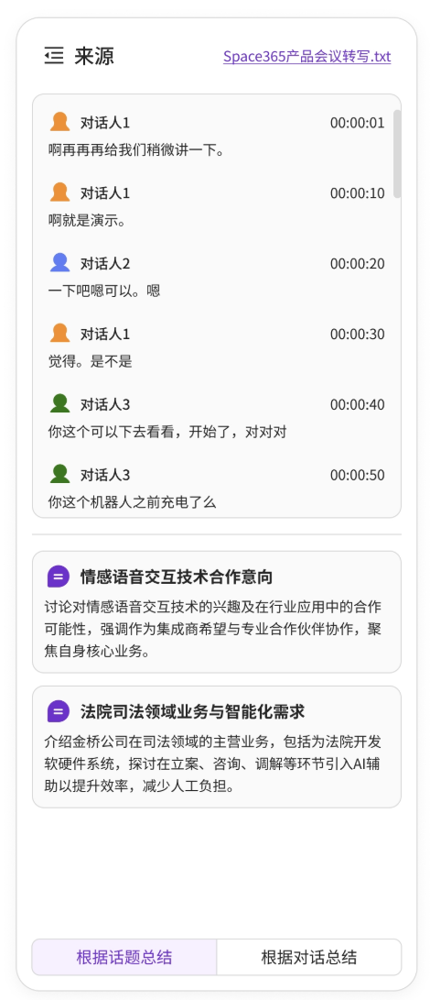

# Needs

I want to refactor the layout for the note taking workspace panel.

Currently it looks like this.
What I want is to change,
In a morden IDE, there is a util panel at left and a chatbot panel at right. In the middle is the code panel
I'd like to use this layout in my workspace with the same art style
here is a simple page I made in Figma.

of course, learn the big layout not the little details, we are making something different
Use noraml liquid div not  the flexable one for this refactor

For edit, you edit the file in
E:\Project\_MeetingNoteTaking\AgenticNoteTakingFE\src\Modules\WorkSpacePanel
don't touch Legacy folder, you should learn from legacy folder but not use and edit it

# Plan

NEVER USE OR MODIFY THE LEGACY FOLDER

## Phase 1 Big Layout


## Phase 2 Source panel

Look at E:\Project\_MeetingNoteTaking\AgenticNoteTakingFE\src\Modules\WorkSpacePanel\Legacy\NotetakingContent to get an idea of what it looks like before

Now I want to have  this kind of layout this is just a sketch do not follow it exactly
I just want you to follow the big layout not the detail.

So, I want a inner liquid glass block for the processed transcript and a line below and the topics section

### ASCII Layout

```
┌─────────────────────────────────────────┐
│ SourcePanel (outer LiquidGlassDiv)     │
│ variant="chat"                          │
│                                         │
│  ┌───────────────────────────────────┐ │
│  │ Header Section                    │ │
│  │  Source  [Space365产品会议转写.txt] │ │
│  └───────────────────────────────────┘ │
│                                         │
│  ┌───────────────────────────────────┐ │
│  │ Processed Transcript              │ │
│  │ (inner LiquidGlassDiv, scrollable)│ │
│  │                                   │ │
│  │  👤 对话A1    00:00:01            │ │
│  │  啊再再再给我们描微进一下。       │ │
│  │                                   │ │
│  │  👤 对话A1    00:00:10            │ │
│  │  啊就是演示。                     │ │
│  │                                   │ │
│  │  👤 对话A2    00:00:20            │ │
│  │  一下吧啊可以。嗯                 │ │
│  │                                   │ │
│  └───────────────────────────────────┘ │
│                                         │
│  ───────────────────────────────────── │
│                                         │
│  ┌───────────────────────────────────┐ │
│  │ Topics Section (scrollable)       │ │
│  │                                   │ │
│  │  ┌─────────────────────────────┐ │ │
│  │  │ 💬 情感话音交互技术合作意向  │ │ │
│  │  │ 讨论对情感话音交互技术的...  │ │ │
│  │  └─────────────────────────────┘ │ │
│  │                                   │ │
│  │  ┌─────────────────────────────┐ │ │
│  │  │ 💬 法院司法领域业务与智能化需求│ │ │
│  │  │ 介绍金杯公司在司法领域的...  │ │ │
│  │  └─────────────────────────────┘ │ │
│  │                                   │ │
│  └───────────────────────────────────┘ │
└─────────────────────────────────────────┘
```

### Implementation Steps

1. **Create outer container structure**
   - Use `LiquidGlassDiv` with `variant="chat"` to minimize padding
   - Main container div with flex column layout

2. **Header section**
   - Title "Source" (no icon needed)
   - Filename display on the right side
   - Flex layout for alignment

3. **Processed Transcript section**
   - Inner `LiquidGlassDiv` for glass effect
   - Scrollable container with `liquid-glass-scrollbar` class
   - Each utterance item contains:
     - Speaker icon (`/icons/user.png`) + name (left)
     - Timestamp (right)
     - Text content below
   - Different speaker colors using existing theme

4. **Divider line**
   - Simple horizontal line between sections
   - Subtle styling matching liquid glass aesthetic

5. **Topics section**
   - Scrollable container with `liquid-glass-scrollbar` class
   - Each topic is a **separate card** (inner LiquidGlassDiv):
     - Topic icon (`/icons/topics.png`) + topic title
     - Topic description/summary text
     - Margin between cards for separation
   - Note: Topics are individual cards, NOT like speakers list

6. **Styling**
   - Use existing CSS from Components.css and Modules.css
   - Match ChatBox styling for consistency
   - Proper spacing with CSS variables
   - Responsive flex layout
