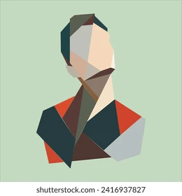

low-poly art style made entirely of sharp triangular polygons, faceted shading,
geometric polygon mesh look, flat color triangles only, no smooth gradients,
crisp vector-like edges, isolated subject on pure white background

1. venus 2. david 3. The thinker 4. Winged Victory of Samothrace